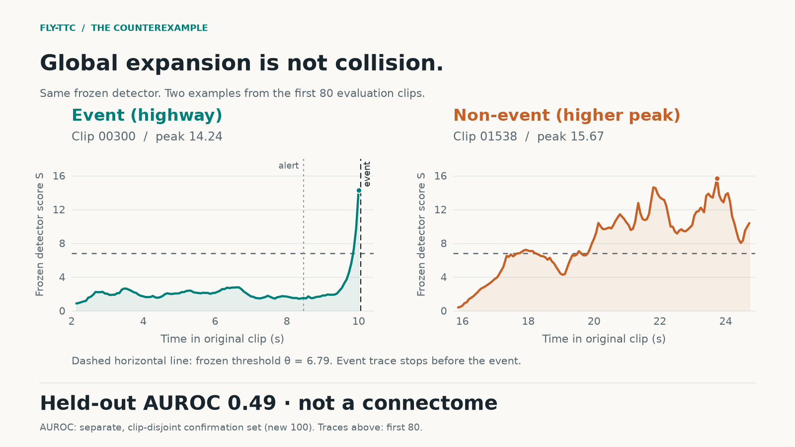
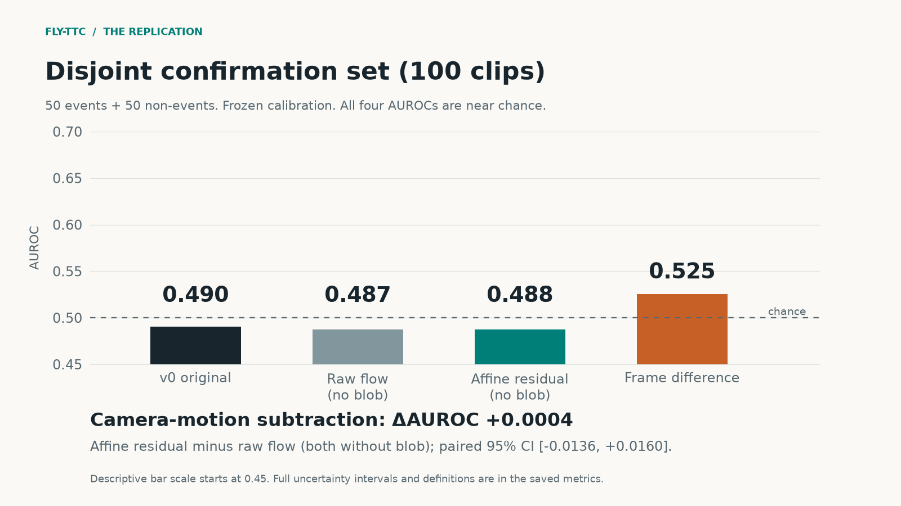
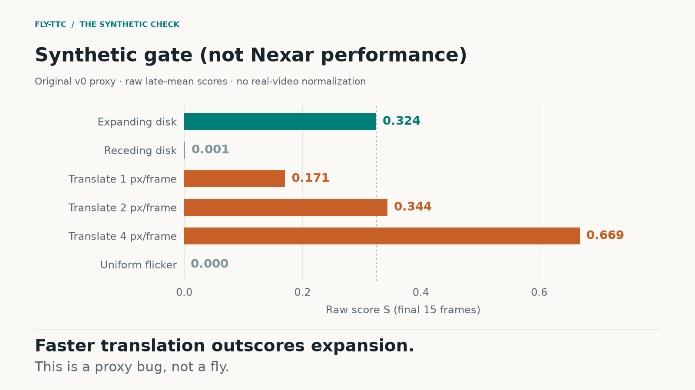

# fly-ttc

A frozen **looming proxy** inspired by Drosophila LPLC2 / Giant Fiber,
scored on the public Nexar Collision Prediction dashcam set.

This is not a 166k-neuron MaleCNS simulation, not a trained video model,
and not a driving policy. Held-out performance was at chance.



Same detector. Clip `00300` is a labeled event; clip `01538` is normal driving with a higher peak. Global expansion is not collision.

## What we ran

A fixed CPU/OpenCV Farneback pipeline combines positive flow divergence, outward radial flow, and an image-difference blob-expansion term. Negative calibration clips determine component normalization and a clip-level threshold; there are no learned video-model weights. This is an engineering proxy, **not a connectome** or a reproduction of the biological LPLC2/Giant Fiber circuit.

We used 200 public Nexar **train** clips in two stages:

- **Initial 100:** 50 positive and 50 negative clips, divided into 20 calibration clips and 80 evaluation clips. The headline initial AUROC, 0.546, is for the **80 evaluation clips**.
- **Additional 100:** 50 positive and 50 negative clips, with no overlapping clip IDs or source-file SHA256 values. The four model variants, settings, and calibration were frozen before this confirmation set was scored. Thresholds used the original 10 negative calibration clips.

The confirmation comparison tests a robust global affine flow subtraction, with blob expansion removed from **both** the raw-flow comparator and residual-flow candidate. Original v0 and frame difference are separate controls. [Methods, complete scores, and limitations](docs/RESULTS.md) explain what this comparison establishes.

## What we did not run

We did not simulate MaleCNS or FlyWire, use a whole-brain connectivity matrix, train a neural video predictor, or control a vehicle. No steering, braking, or driving policy is implemented. RAFT and BADAS-Open were not evaluated. This work does not validate or invalidate another team's brain simulation, and it does not establish how a real fly would perform on dashcam labels.

A separate synthetic experiment implements a small local direction-opponent model named `proxy_not_zhao_star`. Its activation-map film and synthetic metrics concern that **different model**, not the Nexar v0 result shown here. See [the separate experiment note](docs/RESULTS.md#separate-local-reflex-experiment).

## Results

| Split | n (pos/neg) | Model | AUROC | AP | TPR | FPR |
|---|---|---|---:|---:|---:|---:|
| Evaluation (first 80) | 40/40 | v0 expansion | 0.546 | 0.524 | 7/40 | 8/40 |
| Confirmation (new 100) | 50/50 | v0 original | 0.490 | 0.538 | 9/50 | 10/50 |
| Confirmation | 50/50 | affine residual | 0.488 | 0.528 | 8/50 | 10/50 |
| Confirmation | 50/50 | frame difference | 0.525 | 0.548 | 9/50 | 10/50 |

The prespecified comparison was **affine residual minus raw flow, with no blob term in either**: AUROC 0.4876 minus 0.4872 = **+0.0004**, paired-bootstrap 95% interval **[-0.0136, +0.0160]**. This is not a delta against original v0. There was no evidence of improvement from this particular affine correction.



AP means average precision. TPR and FPR show counts at frozen thresholds; the target 10% calibration FPR did not carry over to confirmation. Positive clips include collisions **and near-misses**. Scores use pre-event maxima, not continuous-drive collision probabilities or the official Nexar challenge's AP protocol.

The new 100 were held out **at the time of that experiment**. All 200 are now inspected data. Clip separation was verified; independent trips, locations, drivers, or source events were not. The small, condition-balanced sample does not represent real-road accident prevalence. Original v0 confirmation AUROC was 0.4904, with a 95% bootstrap interval of [0.3788, 0.6040].



Faster translation can outscore the expanding disk in the original proxy. This diagnoses a limitation of this implementation; it is not a measurement of a fly's selectivity.

## Reproduce

Use Python 3.10 or newer. Commands below run from the repository root. Python 3.12 was used for the saved experiment; dependency versions are recorded in `requirements-lock.txt`.

```bash
python3 -m venv .venv
source .venv/bin/activate
python -m pip install -e ".[dev]"
python -m pytest -q
```

For the recorded package versions, install `requirements-lock.txt` before the editable package. Other operating systems and decoder/library versions may produce different optical-flow values; matching saved tables is not the same as establishing numerical identity across platforms.

**Inspect and redraw the published result without video downloads:**

```bash
python scripts/make_english_figures.py
```

The figures use saved scores. No Farneback extraction is run by that script. The public package excludes frame caches but includes the 253 saved score rows used by the hero. Figures redraw from that small score-only bundle; no video is needed.

**Recompute the original subset:** read the [Nexar data license](https://huggingface.co/datasets/nexar-ai/nexar_collision_prediction/blob/main/LICENSE), then download the selected 100 clips from the pinned source revision. There is no need to download the full dataset or the author's environment and cache folders.

```bash
python scripts/download_nexar.py --subset 100 --seed 0 \
  --revision aa97deda5a59f00bb7187739053b7c72e14374df \
  --raw-dir data/raw/reproduce_nexar \
  --manifest-dir data/processed/reproduce/manifests

python - <<'PY'
from pathlib import Path
import yaml

config = yaml.safe_load(Path("configs/default.yaml").read_text())
base = "data/processed/reproduce"
config["paths"].update(
    raw_dir="data/raw/reproduce_nexar",
    manifest=f"{base}/manifests/subset_100_seed0.csv",
    output_dir=f"{base}/v0",
)
config["followup"].update(
    baseline_run=f"{base}/v0",
    output_dir=f"{base}/ego_motion",
    source_manifest=f"{base}/manifests/train.csv",
    confirmation_manifest=f"{base}/manifests/confirmation_100_seed1.csv",
)
Path("configs/reproduce.yaml").write_text(yaml.safe_dump(config, sort_keys=False))
PY

python scripts/run_v0.py --config configs/reproduce.yaml
```

The generated config changes storage locations only and writes the reproduction separately from published outputs. Public ID lists are audit records; the download command rebuilds full local metadata from the pinned source. The seed-0 sampler selects 50 clips per class while cycling scene/light conditions. Authentication, if required by the data host, is supplied through an environment variable; never add credentials to the repository.

**Recompute the additional 100 and four-model comparison**, after the v0 run above:

```bash
python scripts/run_ego_ablation.py --config configs/reproduce.yaml --phase prepare
python scripts/run_ego_ablation.py --config configs/reproduce.yaml --phase download
python scripts/run_ego_ablation.py --config configs/reproduce.yaml --phase run
```

`prepare` selects the disjoint seed-1 sample and freezes the local reproduction protocol. An already completed experiment refuses another `run`. Recomputing these known clips reproduces an analysis; it does not create a new untouched test set. Legacy report generators produce Korean archival reports. This README, the public English results note, and `docs/figures/` are the English publication layer.

## License

Code is distributed under the [MIT license](LICENSE). **Nexar videos are not included** and remain subject to **nexar-open-data-license**. Repository scores and plots do not relicense the source data.

Data attribution: Copyright (c) 2025 Nexar Inc. Moura, Daniel C., and Zvitia, Orly. *Nexar Collison Dataset*. Hugging Face, 2025. [Official dataset and license](https://huggingface.co/datasets/nexar-ai/nexar_collision_prediction).

## References

- Moura, D. C., Zhu, S., and Zvitia, O. (2025). *Nexar Dashcam Collision Prediction Dataset and Challenge*. [arXiv:2503.03848](https://arxiv.org/abs/2503.03848). Dataset and benchmark reference; our clip-maximum evaluation is a separate protocol.
- Klapoetke, N. C. et al. (2017). *Ultra-selective looming detection from radial motion opponency*. Nature 551, 237-241. [doi:10.1038/nature24626](https://doi.org/10.1038/nature24626). Biological inspiration only.
- Ache, J. M. et al. (2019). *Neural Basis for Looming Size and Velocity Encoding in the Drosophila Giant Fiber Escape Pathway*. Current Biology 29, 1073-1081.e4. [Publisher article](https://www.sciencedirect.com/science/article/pii/S0960982219301381). Biological inspiration only.
